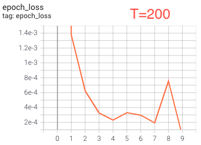
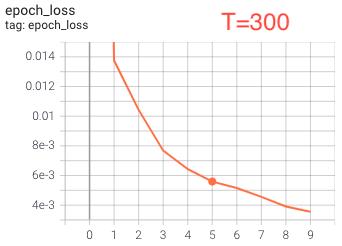

# Project Batuketa


## Installing the package

This project requires Python 3.7 or 3.8. The models are neural
networks coded in Tensorflow 2.5.0.

Batuketa uses [poetry](https://python-poetry.org/) as a build tool and
dependency manager. Poetry takes care of creating, maintaining, and
activating/deactivating a dedicated virtual environment for the
project without you having to do it. Once the virtual environment has
been created by poetry (which typicall happens on a first run of
`poetry install`), any command prefixed by "poetry run" will be
automagically executed in this virtual environment.

Those steps are needed to build and install the package, and to run a
sample training/evalution script:

1. Clone the repository and `cd` into it.
1. Make sure you've got the latest version of the `poetry` tool
   available in your Python installation, otherwise install it by
   issuing `pip install --upgrade poetry`.
1. Install the project as a Python module along with its dependencies
   by issuing `poetry install` (make sure you're in the directory with
   the cloned git repository of the project).
1. Run unit tests by issuing `poetry run pytest`.

## Running the code

Run model training and evaluation by issuing `poetry run python
scripts/train_attention_model.py`. A typical output would look like

```bash
➜  batuketa git:(master) ✗ poetry run python scripts/train_attention_model.py
Training the attention-based model:
Epoch 1/10
1000/1000 [==============================] - 24s 23ms/step - loss: 0.0881
Epoch 2/10
1000/1000 [==============================] - 9s 9ms/step - loss: 0.0018
Epoch 3/10
1000/1000 [==============================] - 9s 9ms/step - loss: 5.4623e-04
Epoch 4/10
1000/1000 [==============================] - 8s 8ms/step - loss: 2.0604e-04
Epoch 5/10
1000/1000 [==============================] - 9s 9ms/step - loss: 1.3697e-04
Epoch 6/10
1000/1000 [==============================] - 9s 9ms/step - loss: 7.1329e-05
Epoch 7/10
1000/1000 [==============================] - 9s 9ms/step - loss: 8.8166e-05
Epoch 8/10
1000/1000 [==============================] - 9s 9ms/step - loss: 1.5731e-04
Epoch 9/10
1000/1000 [==============================] - 9s 9ms/step - loss: 1.3176e-04
Epoch 10/10
1000/1000 [==============================] - 9s 9ms/step - loss: 6.5662e-05
Evaluating the attention-based model:
100/100 [==============================] - 2s 20ms/step - loss: 2.7954e-05
Evaluating the perfect model:
100/100 [==============================] - 0s 616us/step - loss: 1.7770e-15
```

In the above step, an attention-based model is trained for ten epochs
on the training dataset, then it is evaluated against the eval
dataset. Additionally, the "perfect" model is evaluated on the same
eval dataset for the sake of performance comparison.

The loss is the mean squared error between the prediction and the
ground truth.

The file
[scripts/train_attention_model.py](scripts/train_attention_model.py)
represents a short, user-friendly driver script with a few
hyperparameters that can be changed in order to evaluate the
performance of the model for different settings.

The training script outputs training statistics to the directory
`logs/` in the [Tensorboard](https://www.tensorflow.org/tensorboard)
format. You can start Tensorboard serving this data by running `poetry
run tensorboard --logdir logs` and by pointing your browser to the
shown address (typically, `http://localhost:6006/`).


## Performance of the model for different sequence lengths

The figures below represent the dynamics of the epoch training loss
over ten training epochs for sequence length equal to 100, 200, 300,
and 400:






Note that despite somewhat noisy loss behaviour in the late training
epochs, those losses are extremely good as initially the randomly
initialised weights result in losses of the order of magnitude of
`1.0e0`.

## Choice of models

### The attention-based model

As the primary working model, I implemented a single-headed
[attention](https://arxiv.org/abs/1706.03762)-based network. The main
idea behind the attention technique is to let the model learn how to
attend to different elements of the input sequence depending on their
values.

A crucial intermediate product of the attention architecture is a
square attention matrix of the size given by the sequence length. This
attention matrix encodes the relative importance of the i-th element
of the sequence to the j-th one for all i, j from zero to sequence
length.

Another important component of the attention-based model is the
so-called history mask. This attention masks makes sure that, for each
position in the input sequence, the model takes into account the
influence only of the previous elements, thus ignoring the "unknown"
future.

One performance drawback of the model is its square algorithmic
complexity in the input length.

For more details on the method, please see the [original
paper](https://arxiv.org/abs/1706.03762). I would be also glad to
discuss the details of the approach in person.


### The pefect model

I also implemented the "perfect" model, which is a non-trainable
Tensorflow computational graph that calculates the desired sum of two
elements by design. As it has zero trainable parameters, it's
perfomance with the task is perfect (up to the numerical errors). I
use it as an ideal model to benchmark the attention-based model
against.

### The choice of loss

For both models, I used the squared error between the ground truth and
the predicted sum. The error is averaged across training samples in a
batch.

## Training and evaluation data

The file [batuketa/data.py](batuketa/data.py) contains the code for
lazy generation of Tensorflow Datasets that are used for both training
and model evaluation.


## Code quality assurance

There are two independent Github Actions build scripts in [the
corresponding directory](.github/workflows) for Python versions 3.7
and 3.8.

To run the unit tests, issue `poetry run pytest` (after you have
installed the project along with its dependencies as described above).

The scripts in the [qa](qa/) directory perform formatting checks using
the [black](https://github.com/psf/black) tool, import sorting with
the help of [isort](https://github.com/PyCQA/isort), and static code
analysis with the help of [pylint](https://www.pylint.org/).
